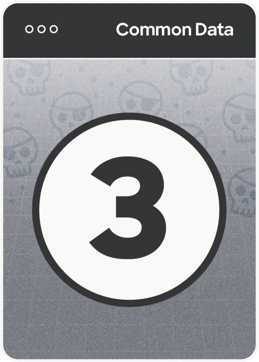

# Data War: Complete Card Reference

This document provides a comprehensive overview of all cards used in Data War gameplay.

## Table of Contents

- [Card Types Overview](#card-types-overview)
- [Common Data Cards](#common-data-cards)
- [Tracker Cards](#tracker-cards)
- [Blocker Cards](#blocker-cards)
- [Firewall Cards](#firewall-cards)
- [Billionaire Move Cards](#billionaire-move-cards)
- [Launch Stack Cards](#launch-stack-cards)
- [Data Grab Cards](#data-grab-cards)
- [Card Data JSON](#card-data-json)

---

## Card Types Overview

| Card Type | Total Count | Point Range | Special Mechanics |
|-----------|-------------|-------------|-------------------|
| Common Data Cards | 40 | 1-5 | Basic point cards |
| Tracker Cards | 6 | 1-3 | Triggers another play, adds points |
| Blocker Cards | 4 | 0 | Triggers another play, subtracts opponent points |
| Firewall Cards | 4 | 6 | Special defensive and offensive actions |
| Billionaire Move Cards | 4 | 6 | Aggressive special actions |
| Launch Stack Cards | 5 | 0 | Win condition cards |
| Data Grab Cards | 3 | 0 | Speed/reaction cards |
| **Total** | **66** | **0-6** | - |

---

## Common Data Cards

The backbone of the game, these cards represent different types of data collection methods. There are 8 copies of each card (40 total).

### Secret Spyware


- **Card IDs:** CD-1-01 through CD-1-08
- **Point Value:** 1
- **Count:** 8 cards
- **Triggers Another Play:** No
- **Special Action:** None
- **Description:** The most common data collection method. Low value but reliable.

---

### Hidden Pixel


- **Card IDs:** CD-2-01 through CD-2-08
- **Point Value:** 2
- **Count:** 8 cards
- **Triggers Another Play:** No
- **Special Action:** None
- **Description:** Invisible tracking pixels embedded in content. Slightly more valuable than spyware.

---

### Cafe Pirates!


- **Card IDs:** CD-3-01 through CD-3-08
- **Point Value:** 3
- **Count:** 8 cards
- **Triggers Another Play:** No
- **Special Action:** None
- **Description:** Data stolen from unsecured public Wi-Fi networks. Mid-range value.

---

### Email Trail


- **Card IDs:** CD-4-01 through CD-4-08
- **Point Value:** 4
- **Count:** 8 cards
- **Triggers Another Play:** No
- **Special Action:** None
- **Description:** Following user email patterns and metadata. High value common card.

---

### Cookie Crumbs


- **Card IDs:** CD-5-01 through CD-5-08
- **Point Value:** 5
- **Count:** 8 cards
- **Triggers Another Play:** No
- **Special Action:** None
- **Description:** Third-party cookies tracking across sites. Highest value common card.

---

## Tracker Cards

Powerful cards that add to your play value and trigger an additional play. Limited to 2 copies each (6 total).

### Cross Site Stalker


- **Card IDs:** TR-1-01, TR-1-02
- **Point Value:** 1
- **Count:** 2 cards
- **Triggers Another Play:** Yes
- **Special Action:** Add 1 point to the value of your play.
- **Description:** Follows users across multiple websites. Adds bonus point and allows another card play.

---

### Social Snooper


- **Card IDs:** TR-2-01, TR-2-02
- **Point Value:** 2
- **Count:** 2 cards
- **Triggers Another Play:** Yes
- **Special Action:** Add 2 points to the value of your play.
- **Description:** Harvests data from social media platforms. Adds 2 bonus points and triggers another play.

---

### Cursed Cursor


- **Card IDs:** TR-3-01, TR-3-02
- **Point Value:** 3
- **Count:** 2 cards
- **Triggers Another Play:** Yes
- **Special Action:** Add 3 points to the value of your play.
- **Description:** Tracks every mouse movement and interaction. Most powerful tracker with 3 bonus points.

---

## Blocker Cards

Defensive cards that reduce opponent scores. Limited to 2 copies each (4 total).

### Enhanced Tracking Protection


- **Card IDs:** BL-1-01, BL-1-02
- **Point Value:** 0
- **Count:** 2 cards
- **Triggers Another Play:** Yes
- **Special Action:** Subtract 1 point from the value of all opponent plays (this card has no value).
- **Description:** Firefox's basic privacy feature. Reduces all opponent plays by 1 point.

---

### Total Cookie Protection


- **Card IDs:** BL-2-01, BL-2-02
- **Point Value:** 0
- **Count:** 2 cards
- **Triggers Another Play:** Yes
- **Special Action:** Subtract 2 points from the value of all opponent plays (this card has no value).
- **Description:** Firefox's advanced privacy feature. Reduces all opponent plays by 2 points.

---

## Firewall Cards

Unique Firefox-themed cards with powerful protective abilities. One copy each (4 total).

### Forced Empathy


- **Card ID:** FW-ForcedEmpathy-6-01
- **Point Value:** 6
- **Count:** 1 card
- **Triggers Another Play:** No
- **Special Action:** All players immediately pass their decks one position to the right (instant).
- **Description:** Forces perspective change. Redistributes resources among players.

---

### Open What You Want


- **Card ID:** FW-OpenWhatYouWant-6-01
- **Point Value:** 6
- **Count:** 1 card
- **Triggers Another Play:** No
- **Special Action:** On your next play, look at the top 3 cards of your deck and arrange them in any order (exclude face-down War cards).
- **Description:** Gives you control and knowledge. Stack your deck for advantage.

---

### Tracker Smacker


- **Card ID:** FW-TrackerSmacker-6-01
- **Point Value:** 6
- **Count:** 1 card
- **Triggers Another Play:** No
- **Special Action:** Negate all opponent Tracker and Billionaire Move effects for the remainder of this turn (instant).
- **Description:** Shuts down tracking. Nullifies powerful opponent card effects.

---

### Mandatory Recall


- **Card ID:** FW-MandatoryRecall-6-01
- **Point Value:** 6
- **Count:** 1 card
- **Triggers Another Play:** No
- **Special Action:** If you win this hand, all opponents shuffle Launch Stacks back into their decks.
- **Description:** Forces product recalls. Disrupts opponent win conditions.

---

## Billionaire Move Cards

Aggressive cards representing ruthless business tactics. One copy each (4 total).

### Hostile Takeover


- **Card ID:** BM-HostileTakeover-6-01
- **Point Value:** 6
- **Count:** 1 card
- **Triggers Another Play:** No
- **Special Action:** All opponents instantly go to WAR against this 6; winner takes all. Ignores Trackers, Blockers, and ties on original play.
- **Description:** Forces immediate confrontation. High risk, high reward aggressive play.

---

### Patent Theft


- **Card ID:** BM-PatentTheft-6-01
- **Point Value:** 6
- **Count:** 1 card
- **Triggers Another Play:** No
- **Special Action:** If you win this hand, steal 1 Launch Stack card from any opponent.
- **Description:** Steals innovation. Directly attacks opponent win conditions.

---

### Leveraged Buyout


- **Card ID:** BM-LeveragedBuyout-6-01
- **Point Value:** 6
- **Count:** 1 card
- **Triggers Another Play:** No
- **Special Action:** If you win this hand, take 2 cards from the top of all opponent decks and add them to yours.
- **Description:** Acquires competitor resources. Weakens opponents while strengthening yourself.

---

### Temper Tantrum


- **Card ID:** BM-TemperTantrum-6-01
- **Point Value:** 6
- **Count:** 1 card
- **Triggers Another Play:** No
- **Special Action:** If you lose this hand, steal 2 cards from the winner's win pile before they collect them.
- **Description:** Bad loser behavior. Even in defeat, you take something from the winner.

---

## Launch Stack Cards

Win condition cards. Collect 3 different Launch Stacks to win the game. One copy each (5 total).

### Set up a Shadow Government


- **Card ID:** LS-ShadowGov-01
- **Point Value:** 0
- **Count:** 1 card
- **Triggers Another Play:** Yes
- **Special Action:** Collect 3 Launch Stacks to win the game.
- **Description:** Political manipulation at the highest level. Part of your path to victory.

---

### Buy a Rocket Company


- **Card ID:** LS-BuyRocketCo-01
- **Point Value:** 0
- **Count:** 1 card
- **Triggers Another Play:** Yes
- **Special Action:** Collect 3 Launch Stacks to win the game.
- **Description:** Space ambitions funded by data. Part of your path to victory.

---

### Buy a Newspaper and Shut it Down


- **Card ID:** LS-NewspaperShutdown-01
- **Point Value:** 0
- **Count:** 1 card
- **Triggers Another Play:** Yes
- **Special Action:** Collect 3 Launch Stacks to win the game.
- **Description:** Silencing the press. Part of your path to victory.

---

### Divert the Entire Energy Grid


- **Card ID:** LS-DivertEnergyGrid-01
- **Point Value:** 0
- **Count:** 1 card
- **Triggers Another Play:** Yes
- **Special Action:** Collect 3 Launch Stacks to win the game.
- **Description:** Power consumption for crypto/AI. Part of your path to victory.

---

### Launch AI Platform to Parent Your Kids


- **Card ID:** LS-AIParents-01
- **Point Value:** 0
- **Count:** 1 card
- **Triggers Another Play:** Yes
- **Special Action:** Collect 3 Launch Stacks to win the game.
- **Description:** Outsourcing child-rearing to algorithms. Part of your path to victory.

---

## Data Grab Cards

Special speed/reaction cards that create chaotic moments. Two copies (2 total).

### Data Grab


- **Card IDs:** DG-01, DG-02, DG-03
- **Point Value:** 0
- **Count:** 3 cards
- **Triggers Another Play:** No
- **Special Action:** Everyone grabs as many cards from the play area as possible.
- **Description:** Chaos ensues! Physical dexterity determines who gets the data. Creates exciting moments.

---

## Card Data JSON

The following JSON object can be used for gameplay implementation:

```json
{
  "cards": [
    { "id": "CD-1-01", "name": "Secret Spyware", "point_value": 1, "triggers_another_play": false, "special_action": "none" },
    { "id": "CD-1-02", "name": "Secret Spyware", "point_value": 1, "triggers_another_play": false, "special_action": "none" },
    { "id": "CD-1-03", "name": "Secret Spyware", "point_value": 1, "triggers_another_play": false, "special_action": "none" },
    { "id": "CD-1-04", "name": "Secret Spyware", "point_value": 1, "triggers_another_play": false, "special_action": "none" },
    { "id": "CD-1-05", "name": "Secret Spyware", "point_value": 1, "triggers_another_play": false, "special_action": "none" },
    { "id": "CD-1-06", "name": "Secret Spyware", "point_value": 1, "triggers_another_play": false, "special_action": "none" },
    { "id": "CD-1-07", "name": "Secret Spyware", "point_value": 1, "triggers_another_play": false, "special_action": "none" },
    { "id": "CD-1-08", "name": "Secret Spyware", "point_value": 1, "triggers_another_play": false, "special_action": "none" },

    { "id": "CD-2-01", "name": "Hidden Pixel", "point_value": 2, "triggers_another_play": false, "special_action": "none" },
    { "id": "CD-2-02", "name": "Hidden Pixel", "point_value": 2, "triggers_another_play": false, "special_action": "none" },
    { "id": "CD-2-03", "name": "Hidden Pixel", "point_value": 2, "triggers_another_play": false, "special_action": "none" },
    { "id": "CD-2-04", "name": "Hidden Pixel", "point_value": 2, "triggers_another_play": false, "special_action": "none" },
    { "id": "CD-2-05", "name": "Hidden Pixel", "point_value": 2, "triggers_another_play": false, "special_action": "none" },
    { "id": "CD-2-06", "name": "Hidden Pixel", "point_value": 2, "triggers_another_play": false, "special_action": "none" },
    { "id": "CD-2-07", "name": "Hidden Pixel", "point_value": 2, "triggers_another_play": false, "special_action": "none" },
    { "id": "CD-2-08", "name": "Hidden Pixel", "point_value": 2, "triggers_another_play": false, "special_action": "none" },

    { "id": "CD-3-01", "name": "Cafe Pirates!", "point_value": 3, "triggers_another_play": false, "special_action": "none" },
    { "id": "CD-3-02", "name": "Cafe Pirates!", "point_value": 3, "triggers_another_play": false, "special_action": "none" },
    { "id": "CD-3-03", "name": "Cafe Pirates!", "point_value": 3, "triggers_another_play": false, "special_action": "none" },
    { "id": "CD-3-04", "name": "Cafe Pirates!", "point_value": 3, "triggers_another_play": false, "special_action": "none" },
    { "id": "CD-3-05", "name": "Cafe Pirates!", "point_value": 3, "triggers_another_play": false, "special_action": "none" },
    { "id": "CD-3-06", "name": "Cafe Pirates!", "point_value": 3, "triggers_another_play": false, "special_action": "none" },
    { "id": "CD-3-07", "name": "Cafe Pirates!", "point_value": 3, "triggers_another_play": false, "special_action": "none" },
    { "id": "CD-3-08", "name": "Cafe Pirates!", "point_value": 3, "triggers_another_play": false, "special_action": "none" },

    { "id": "CD-4-01", "name": "Email Trail", "point_value": 4, "triggers_another_play": false, "special_action": "none" },
    { "id": "CD-4-02", "name": "Email Trail", "point_value": 4, "triggers_another_play": false, "special_action": "none" },
    { "id": "CD-4-03", "name": "Email Trail", "point_value": 4, "triggers_another_play": false, "special_action": "none" },
    { "id": "CD-4-04", "name": "Email Trail", "point_value": 4, "triggers_another_play": false, "special_action": "none" },
    { "id": "CD-4-05", "name": "Email Trail", "point_value": 4, "triggers_another_play": false, "special_action": "none" },
    { "id": "CD-4-06", "name": "Email Trail", "point_value": 4, "triggers_another_play": false, "special_action": "none" },
    { "id": "CD-4-07", "name": "Email Trail", "point_value": 4, "triggers_another_play": false, "special_action": "none" },
    { "id": "CD-4-08", "name": "Email Trail", "point_value": 4, "triggers_another_play": false, "special_action": "none" },

    { "id": "CD-5-01", "name": "Cookie Crumbs", "point_value": 5, "triggers_another_play": false, "special_action": "none" },
    { "id": "CD-5-02", "name": "Cookie Crumbs", "point_value": 5, "triggers_another_play": false, "special_action": "none" },
    { "id": "CD-5-03", "name": "Cookie Crumbs", "point_value": 5, "triggers_another_play": false, "special_action": "none" },
    { "id": "CD-5-04", "name": "Cookie Crumbs", "point_value": 5, "triggers_another_play": false, "special_action": "none" },
    { "id": "CD-5-05", "name": "Cookie Crumbs", "point_value": 5, "triggers_another_play": false, "special_action": "none" },
    { "id": "CD-5-06", "name": "Cookie Crumbs", "point_value": 5, "triggers_another_play": false, "special_action": "none" },
    { "id": "CD-5-07", "name": "Cookie Crumbs", "point_value": 5, "triggers_another_play": false, "special_action": "none" },
    { "id": "CD-5-08", "name": "Cookie Crumbs", "point_value": 5, "triggers_another_play": false, "special_action": "none" },

    { "id": "TR-1-01", "name": "Cross Site Stalker", "point_value": 1, "triggers_another_play": true, "special_action": "Add 1 point to the value of your play." },
    { "id": "TR-1-02", "name": "Cross Site Stalker", "point_value": 1, "triggers_another_play": true, "special_action": "Add 1 point to the value of your play." },
    { "id": "TR-2-01", "name": "Social Snooper", "point_value": 2, "triggers_another_play": true, "special_action": "Add 2 points to the value of your play." },
    { "id": "TR-2-02", "name": "Social Snooper", "point_value": 2, "triggers_another_play": true, "special_action": "Add 2 points to the value of your play." },
    { "id": "TR-3-01", "name": "Cursed Cursor", "point_value": 3, "triggers_another_play": true, "special_action": "Add 3 points to the value of your play." },
    { "id": "TR-3-02", "name": "Cursed Cursor", "point_value": 3, "triggers_another_play": true, "special_action": "Add 3 points to the value of your play." },

    { "id": "BL-1-01", "name": "Enhanced Tracking Protection", "point_value": 0, "triggers_another_play": true, "special_action": "Subtract 1 point from the value of all opponent plays (this card has no value)." },
    { "id": "BL-1-02", "name": "Enhanced Tracking Protection", "point_value": 0, "triggers_another_play": true, "special_action": "Subtract 1 point from the value of all opponent plays (this card has no value)." },
    { "id": "BL-2-01", "name": "Total Cookie Protection", "point_value": 0, "triggers_another_play": true, "special_action": "Subtract 2 points from the value of all opponent plays (this card has no value)." },
    { "id": "BL-2-02", "name": "Total Cookie Protection", "point_value": 0, "triggers_another_play": true, "special_action": "Subtract 2 points from the value of all opponent plays (this card has no value)." },

    { "id": "FW-ForcedEmpathy-6-01", "name": "Forced Empathy", "point_value": 6, "triggers_another_play": false, "special_action": "All players immediately pass their decks one position to the right (instant)." },
    { "id": "FW-OpenWhatYouWant-6-01", "name": "Open What You Want", "point_value": 6, "triggers_another_play": false, "special_action": "On your next play, look at the top 3 cards of your deck and arrange them in any order (exclude face-down War cards)." },
    { "id": "FW-TrackerSmacker-6-01", "name": "Tracker Smacker", "point_value": 6, "triggers_another_play": false, "special_action": "Negate all opponent Tracker and Billionaire Move effects for the remainder of this turn (instant)." },
    { "id": "FW-MandatoryRecall-6-01", "name": "Mandatory Recall", "point_value": 6, "triggers_another_play": false, "special_action": "If you win this hand, all opponents shuffle Launch Stacks back into their decks." },

    { "id": "BM-HostileTakeover-6-01", "name": "Hostile Takeover", "point_value": 6, "triggers_another_play": false, "special_action": "All opponents instantly go to WAR against this 6; winner takes all. Ignores Trackers, Blockers, and ties on original play." },
    { "id": "BM-PatentTheft-6-01", "name": "Patent Theft", "point_value": 6, "triggers_another_play": false, "special_action": "If you win this hand, steal 1 Launch Stack card from any opponent." },
    { "id": "BM-LeveragedBuyout-6-01", "name": "Leveraged Buyout", "point_value": 6, "triggers_another_play": false, "special_action": "If you win this hand, take 2 cards from the top of all opponent decks and add them to yours." },
    { "id": "BM-TemperTantrum-6-01", "name": "Temper Tantrum", "point_value": 6, "triggers_another_play": false, "special_action": "If you lose this hand, steal 2 cards from the winner's win pile before they collect them." },

    { "id": "LS-ShadowGov-01", "name": "Set up a Shadow Government", "point_value": 0, "triggers_another_play": true, "special_action": "Collect 3 Launch Stacks to win the game." },
    { "id": "LS-BuyRocketCo-01", "name": "Buy a Rocket Company", "point_value": 0, "triggers_another_play": true, "special_action": "Collect 3 Launch Stacks to win the game." },
    { "id": "LS-NewspaperShutdown-01", "name": "Buy a Newspaper and Shut it Down", "point_value": 0, "triggers_another_play": true, "special_action": "Collect 3 Launch Stacks to win the game." },
    { "id": "LS-DivertEnergyGrid-01", "name": "Divert the Entire Energy Grid", "point_value": 0, "triggers_another_play": true, "special_action": "Collect 3 Launch Stacks to win the game." },
    { "id": "LS-AIParents-01", "name": "Launch AI Platform to Parent Your Kids", "point_value": 0, "triggers_another_play": true, "special_action": "Collect 3 Launch Stacks to win the game." },

    { "id": "DG-01", "name": "Data Grab", "point_value": 0, "triggers_another_play": false, "special_action": "Everyone grabs as many cards from the play area as possible." },
    { "id": "DG-02", "name": "Data Grab", "point_value": 0, "triggers_another_play": false, "special_action": "Everyone grabs as many cards from the play area as possible." },
    { "id": "DG-03", "name": "Data Grab", "point_value": 0, "triggers_another_play": false, "special_action": "Everyone grabs as many cards from the play area as possible." }
  ]
}
```

---

## Quick Reference

### Card Distribution by Value
- **0 points:** 12 cards (Blockers, Launch Stacks, Data Grab)
- **1 point:** 10 cards (8 Secret Spyware + 2 Cross Site Stalker)
- **2 points:** 10 cards (8 Hidden Pixel + 2 Social Snooper)
- **3 points:** 10 cards (8 Cafe Pirates! + 2 Cursed Cursor)
- **4 points:** 8 cards (Email Trail)
- **5 points:** 8 cards (Cookie Crumbs)
- **6 points:** 8 cards (4 Firewalls + 4 Billionaire Moves)

### Cards that Trigger Another Play
- All Tracker cards (6 total)
- All Blocker cards (4 total)
- All Launch Stack cards (5 total)
- **Total:** 15 cards trigger another play

### Unique/Single Copy Cards
- Each Firewall card (4 unique)
- Each Billionaire Move card (4 unique)
- Each Launch Stack card (5 unique)
- **Total:** 13 one-of-a-kind cards

